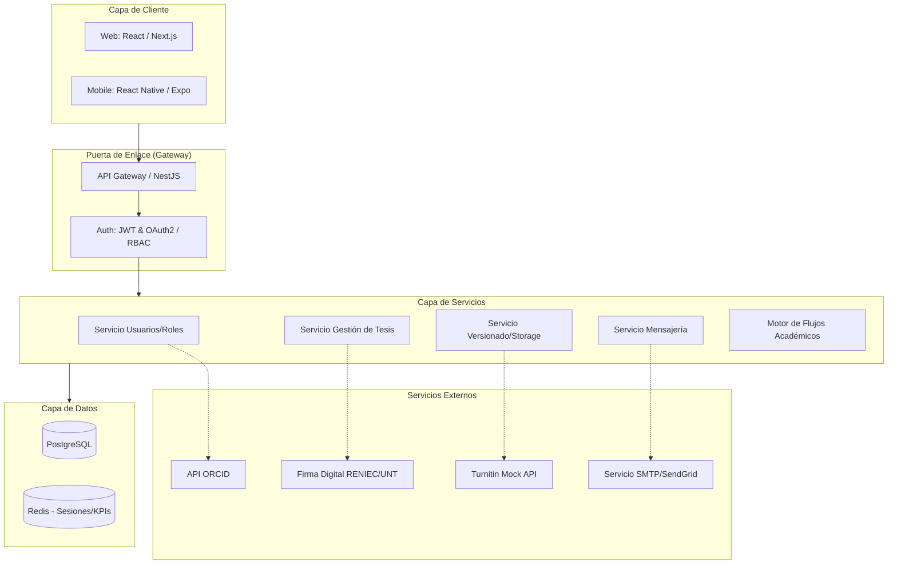
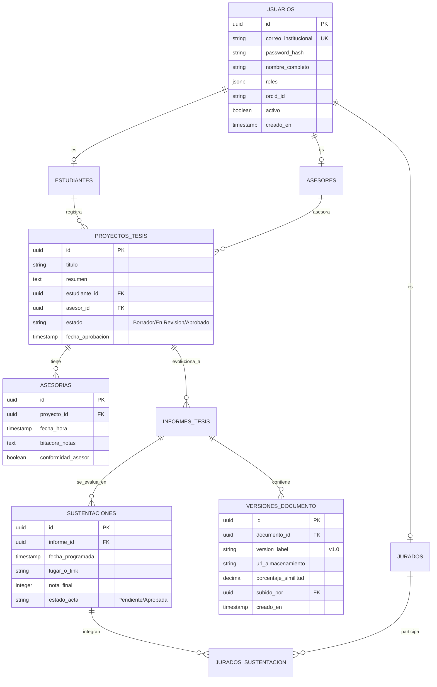

# Arquitectura del Sistema - Gestión de Tesis UNT

Este documento contiene los diagramas arquitectónicos y el modelo de datos de la plataforma.

## 1. Diagrama de Arquitectura de Alto Nivel

El sistema utiliza un enfoque de **Microservicios Modulares** para permitir un crecimiento orgánico. La comunicación entre el frontend y el backend se centraliza en un API Gateway con seguridad unificada.

---

## 2. Modelo de Datos Relacional (ERD)

Diseño de base de datos normalizado con soporte para auditoría completa y campos flexibles mediante JSONB en PostgreSQL.

